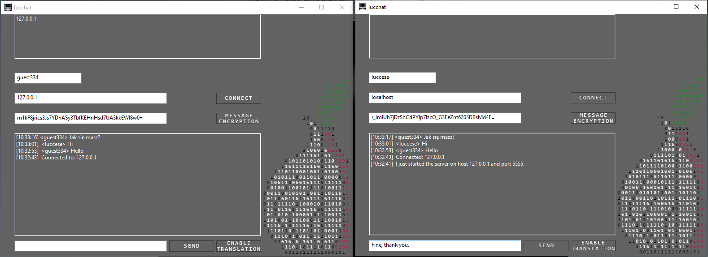

# lucchat
server/client chat through tor with fernet message encryption

- [x] fernet encryption
- [x] message translation
- [ ] logo
- [ ] test server/client through tor
- [x] better design

to start server just click connect when host == localhost
